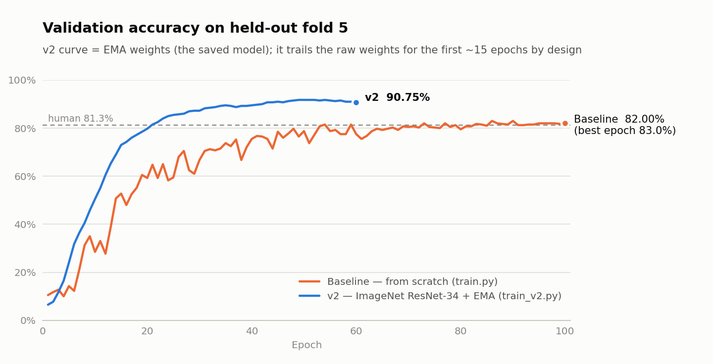
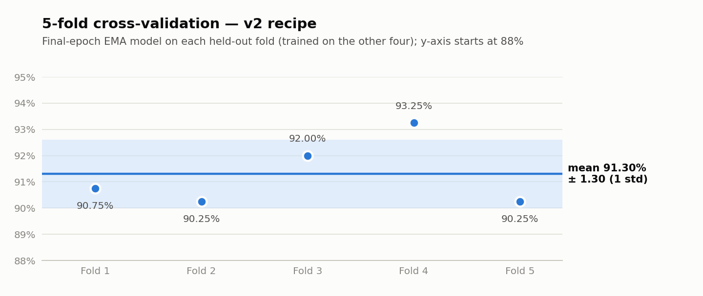
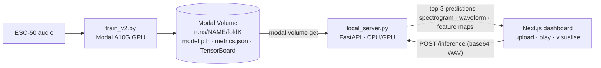

# Audio CNN: Environmental Sound Classification

End-to-end audio ML system: a ResNet-34 CNN that classifies **50 environmental sound classes** (ESC-50) from log-mel spectrograms. It is trained on serverless GPUs, served by a FastAPI inference API, and explored through a Next.js dashboard that plays the clip and visualises what every layer of the network "sees".

**91.3% ± 1.3 accuracy** (5-fold cross-validation), up from 83.0% for the from-scratch baseline. A full training run takes **~2 minutes** on an A10G. Inference runs **fully offline** on a laptop CPU.

---

## Results

<picture>
  <source media="(prefers-color-scheme: dark)" srcset="docs/images/accuracy_curves_dark.png">
  
</picture>

<picture>
  <source media="(prefers-color-scheme: dark)" srcset="docs/images/cv5_folds_dark.png">
  
</picture>

| Model | Evaluation | Accuracy | Train time |
|---|---|---|---|
| Baseline (from scratch) | Fold 5, best epoch | 83.0% | ~48 min |
| **v2** (ImageNet-pretrained ResNet-34) | Fold 5, final epoch | **90.75%** | 2.2 min |
| **v2** | **5-fold CV**, final epoch | **91.30% ± 1.30** | 2.2 min / fold |

For context on ESC-50: human listeners 81.3% · PANNs CNN14 from scratch 83.3% · ImageNet-pretrained ResNet 90.65% · AudioSet-pretrained models 94.7–98.1%.

---

## Research notes

**What moved accuracy from 83% to 91%**, roughly in order of impact:

1. **Transfer learning.** `AudioCNN` has exactly the ResNet-34 layout, so all 216 ImageNet backbone tensors load one-to-one. The first conv's RGB filters are summed into one input channel, and the 50-class head is freshly initialised.
2. **Correct spectrogram frontend.** The original frontend passed `sample_rate=22050` for 44.1 kHz audio, which distorts the mel scale. v2 uses the correct rate, an 80 dB floor, and mean/std normalisation. These settings are stored in the checkpoint so training and inference cannot drift apart.
3. **Stronger regularisation.** 21M parameters on 1,600 clips needs it. v2 applies waveform mixup (Beta 0.4) on every batch, 2× frequency and 2× time masks, random time shift, and ±6 dB random gain.
4. **Fine-tuning optimiser.** Differential learning rates (backbone 3e-4, head 3e-3), warm-up then cosine decay, and no weight decay on BatchNorm or bias.
5. **EMA weights** (decay 0.998). The final averaged model is the one saved and reported.

**Evaluation protocol.**
- Train on 4 folds, test on the held-out fold, and report the **final-epoch** model. No checkpoint is picked by looking at the test fold.
- The baseline's 83% *was* its best epoch on the test fold, so it is slightly optimistic.
- ESC-50 folds keep clips from the same source recording together, so there is no leakage between folds.
- Same-seed reruns vary by about ±0.5 points (GPU non-determinism).

**Why training got 20× faster.**
- The baseline re-decoded audio and rebuilt spectrograms on one CPU core every epoch, which left the GPU idle.
- v2 decodes all 2,000 clips once into GPU memory, computes spectrograms and augmentation on the GPU, and trains in bf16.

### Model

```
log-mel [1 × 128 × 431] ─► Conv7×7/2 (64) ─► MaxPool ─► 3× Res(64) ─► 4× Res(128) ─► 6× Res(256) ─► 3× Res(512)
                         ─► GlobalAvgPool ─► Dropout 0.5 ─► Linear(512 → 50)            21.3M params
Res block: Conv3×3 ─► BN ─► ReLU ─► Conv3×3 ─► BN ─► (+ shortcut) ─► ReLU
```

### Configuration

| | Baseline (`train.py`) | v2 (`train_v2.py`) |
|---|---|---|
| Init | random | ImageNet ResNet-34 |
| Frontend | 128 mel, sample rate mis-set (22.05k), no normalisation | 128 mel @ 44.1 kHz, 20 Hz–22 kHz, top_db 80, standardised |
| Optimiser | AdamW 5e-4, OneCycle (max 2e-3), 100 epochs | AdamW 3e-4 / 3e-3 (backbone / head), wd 0.05, warm-up + cosine, 60 epochs |
| Augmentation | mixup (30% of batches), 1+1 SpecAugment masks | mixup (every batch), 2+2 masks, time shift, gain ±6 dB |
| Regularisation | label smoothing 0.1, dropout 0.5 | + EMA 0.998 |
| Pipeline | CPU decode per epoch, fp32 | GPU-resident data, bf16, channels_last |

---

## System design



| Layer | Stack |
|---|---|
| Model & training | PyTorch 2.8, torchaudio, torchvision (ImageNet weights), TensorBoard |
| Compute | Modal: serverless A10G for training, optional GPU web endpoint (`main.py`) |
| Inference API | FastAPI + Pydantic. The spectrogram settings travel inside each checkpoint |
| Frontend | Next.js 15, React 19, TypeScript, Tailwind, shadcn/ui. Audio playback, prediction bars, and spectrogram, waveform and per-layer feature-map heat-maps |

---

## Quickstart

**Requirements:** Python 3.10–3.12, Node.js 20–24 LTS, and a [Modal](https://modal.com) account (the free tier is plenty; a run costs about $0.05).

**1. Setup**
```bash
git clone https://github.com/Akash-Sakala/audio-cnn.git
cd audio-cnn
python -m venv .venv
.venv\Scripts\activate                # macOS/Linux: source .venv/bin/activate
pip install -r requirements-local.txt
modal setup                           # one-time login
```

**2. Train** (on Modal)
```bash
modal run --detach train_v2.py --run-name v2                         # test on fold 5 (~2 min)
modal run --detach train_v2.py --folds 1,2,3,4,5 --run-name v2_cv5    # optional: 5-fold CV in parallel
```

**3. Download the model**
```bash
modal volume get esc-model runs/v2/fold5/model.pth best_model.pth
```

**4. Run locally** (two terminals)
```bash
# Terminal 1: inference API on http://localhost:8000
python local_server.py --model best_model.pth

# Terminal 2: dashboard on http://localhost:3000
cd audio-cnn-visualisation
npm ci
npm run build
npm start
```

Open http://localhost:3000 and upload any `.wav` file. [ESC-50](https://github.com/karolpiczak/ESC-50/tree/master/audio) clips work well; use ones from the fold the model didn't train on. Detailed Windows notes and troubleshooting are in [setup-guide.md](setup-guide.md).

---

## Repository

```
model.py            AudioCNN, spectrogram frontend, ImageNet weight loader
train_v2.py         v2 training: transfer learning, GPU pipeline, EMA, k-fold CV
train.py            baseline training (from scratch)
local_server.py     offline FastAPI inference server
main.py             Modal GPU inference endpoint
docs/               result charts + make_charts.py
audio-cnn-visualisation/   Next.js dashboard
```

## Credits

Built on [Andreas Trolle's audio-cnn](https://github.com/Andreaswt/audio-cnn) (MIT) · Dataset: [ESC-50](https://github.com/karolpiczak/ESC-50) (CC BY-NC 3.0) · References: [PANNs](https://arxiv.org/abs/1912.10211), [Palanisamy et al. 2020](https://arxiv.org/abs/2007.11154), [SpecAugment](https://arxiv.org/abs/1904.08779). Licensed under MIT, see [LICENSE.MD](LICENSE.MD).
